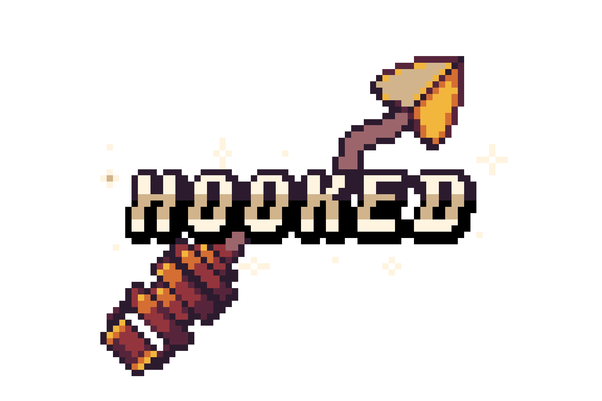

# Hi, I'm Jannis 👋

#### Languages:

#### Game Dev:

#### Web technologies:

#### Version Control:

#### Other Tools:

## Check out Hooked:

Click <a href="https://tanteturner.itch.io/hooked">here</a> for more information on the Project!

## Reach out to me:
[Twitter - @Taneturner1](https://twitter.com/Tanteturner1) |
<a href="mailto: %20jannis.matthies+portfolio@gmail.com">E-Mail<a/>
